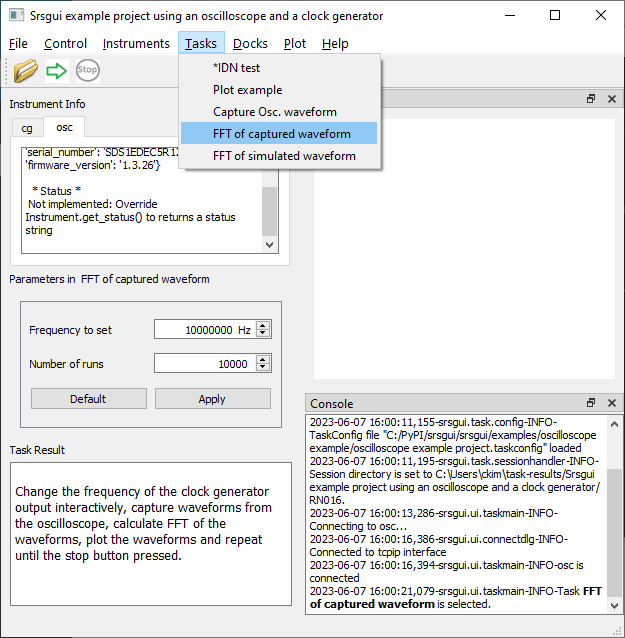
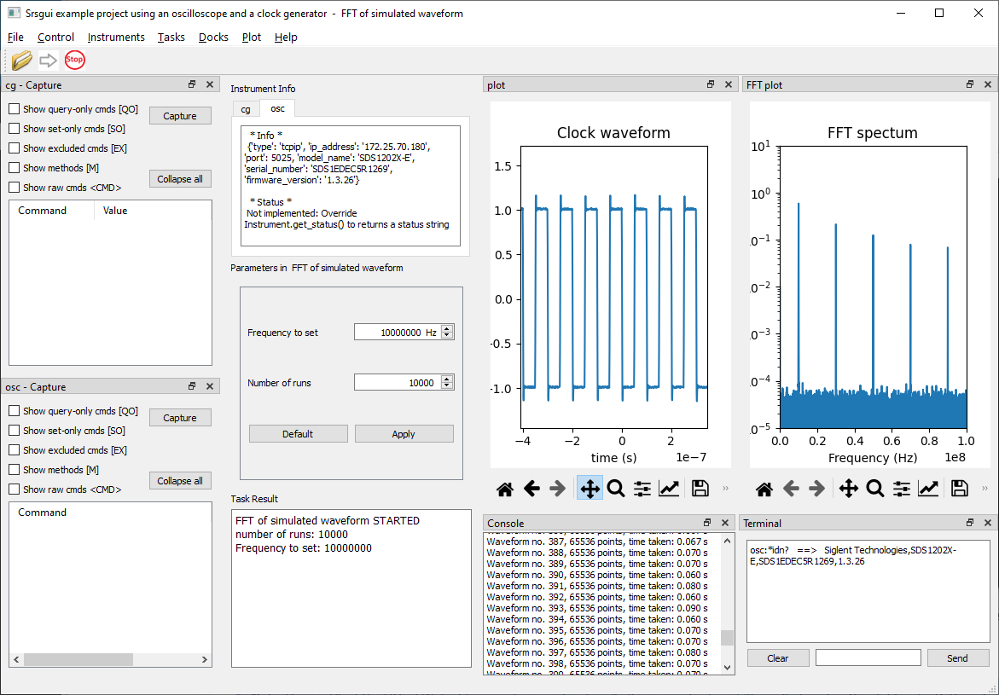
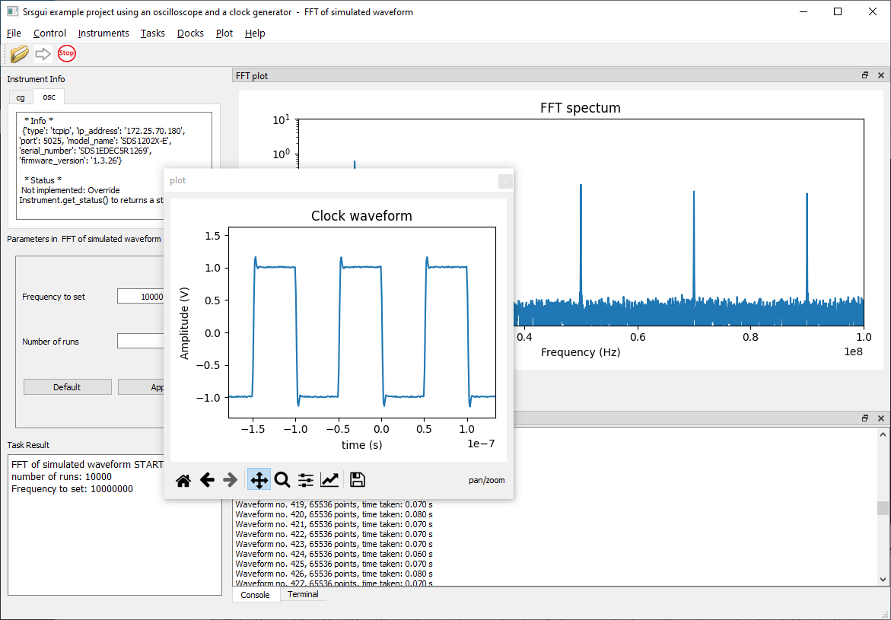
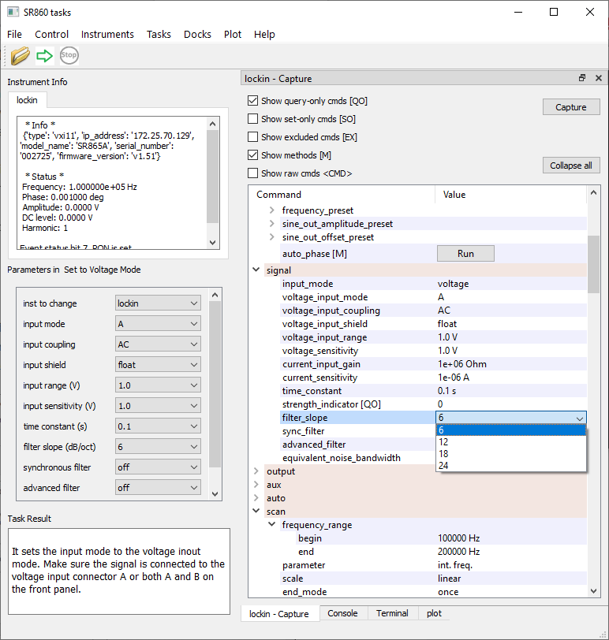

Running ``srsgui`` application
================================

Starting ``srsgui`` application
---------------------------------

With proper installation, you can start ``srsgui`` application by typing one of the following commands from the command promp. If you installed it with a virtual environment, acitvate the virtual environment before stating ``srsgui``.

.. code-block::

    # If python/script directory is in PATH setting,
    srsgui
    
    # If not, 
    python -m srsgui

The initial window looks like the :ref:`image <top-of-initial-screen-capture>`
in the previous page, if ``Srsgui`` is started with the default example project. 

Selecting a configuration file 
-------------------------------

``Srsgui`` application starts, loading the last configuration file it used.
If you want to use a different project from the loaded one, you can choose another one
by selecting a configuration file with the .taskconfig extension from the **menu/File/Open**.

Connecting instruments to use
------------------------------

If you need to control instruments in your tasks, select the instrument from the **menu/Instrument**.
It will bring up the dialog box with connection options. Once an instrument is connected,
the Instrument Info panel displays information on the instrument.

Instruments that will be used in a task must be connected before running the task.
Connection and disconnection of an instrument should be handled in ``srsgui`` application, not from a task.

If you select a instrument that is already connected, it will ask if you want to disconnect the instrument. 

Running a task
---------------
You can choose a task to run from the **menu/Tasks**. Once you select a task,
the Parameters panel will display the parameters for the task, and the description
on the task from the class doc string will be displayed in the Task Result panel.

    Srsgui application with a floating (undocked) dock widget

After selecting the task you want to run, adjust the Parameters if necessary,
and press the green arrow under the menu, or select the **menu/Control/Run**.

Stopping a running task
------------------------

``Srsgui`` application does not kill a running task. Instead, it sets a flag to indicate 
the stop is requested. The running task should check the flag frequently, and stop at its earliest convenience. 

Saving a data file 
--------------------

Every run of a task generates a data file as
*%USERPROFILE%\\task-results\\the_name_in_taskconfig_file\\RNxxx\\task_name-timestamp.sgdata*.
Typically, the *%USERPROFILE%* directory is *C:\\users\\your_user_name* in Windows.
It is the home directory, *$HOME*, in linux.

A default instance of TaskResult class is generated from Task and saved as a Python dictionary.
A task can save Python dictionaries and create tables for large data.

Docking windows in ``srsgui`` application
------------------------------------------ 
 
``Srsgui`` application is a Qt application_ built on QMainWindow_ for GUI.
Thanks to Python Qt binder, such as, Pyside6_, we can write Python scripts using the Qt C++ library.

``Srsgui`` extensively uses QDockWidget_ as a container for its tools,
such as the console, the terminal and the Command Capture. 
By putting the widgets in QDockWidget_, they can be
laid out as many different ways as you want. Qt dock widgets can be docked anywhere
around the main window, stacked togetjer with one another, closed, or floated (undocked)
outside the main window. 

    
    Srsgui application with dock widgets docked

    Srsgui application with a floating (undocked) dock widget
    
The other major GUI component is Matplotlib_, the most popular Python data visualiation library. By putting a Matplotlib_ Figure_ in a QDockWidget_, ``srsgui`` provides 
flexible layouts of multiple Matplotlib_ plots. And encapsulating Matplotlib Figure_
handling into :class:`Task <srsgui.task.task.Task>` class makes it simple to use a
Matplotlib_ figure_ in :class:`Task <srsgui.task.task.Task>` subclasses.

When you choose a dock window from the **menu/Docks**, it will be brought up the dock window
to the top level, even if it is closed.

Command capture dock widgets
-----------------------------

Command capture dock widget is the latest addition to ``srsgui`` application. Each instrument
in the configuration file will have a capture dock widget. You can open it by select the menu item
named as "*instrument_name-caputre*" from the menu/Docks.

It is used to visualize a complex :class:`Instrument <srsgui.inst.instrument.Instrument>` class
containing multiple :class:`components <srsgui.inst.component.Component>` and
:class:`commands <srsgui.inst.commands.Command>` using
`Qt Model/View programming. <model_view_programming_>`_

It captures all the values of remote commands defined in an instrument class,
and allows you to change the values interactively.

An active command capture dock widget generates a lot of communication traffic whenever it needs
to update the item values. If the running task needs the full communication capacity,
close the dock widget not to generate any additional communication load.

It helps you to understand the hierarchical structure of an instrument class
and to use command more easily in the command terminal and writing the Python scripts.

    Remote command capture dock of `SR860 lock-in amplifier instrument class <sr860_>`_

Plot menu
--------------

When you resize a plot window, sometimes the plot does not fit well in the resized windows.
Pressing the **menu/Plot/Adjust Layout**, will adjust the layouts of all the plots in the application.
The layout will change with the next update.

All the figures_ used in ``srsgui`` application are accompanied by
`Matplotlib interactive navigation tool bars <toolbar_>`_.
You can show or hide the toolbars in all the plot windows
by selecting the **menu/Plot/Show or Hide toolbar**.

.. _application: https://doc.qt.io/qt-6/qapplication.html#details
.. _QMainWindow: https://doc.qt.io/qt-6/qmainwindow.html#details
.. _QDockWidget: https://doc.qt.io/qt-5/qdockwidget.html#details
.. _model_view_programming: https://doc.qt.io/qt-6/model-view-programming.html
.. _pyside6: https://doc.qt.io/qtforpython-6/
.. _matplotlib: https://matplotlib.org/
.. _figure: https://matplotlib.org/stable/tutorials/introductory/quick_start.html#figure
.. _figures: https://matplotlib.org/stable/tutorials/introductory/quick_start.html#figure
.. _toolbar: https://matplotlib.org/3.2.2/users/navigation_toolbar.html
.. _sr860: https://pypi.org/project/srsinst.sr860/
