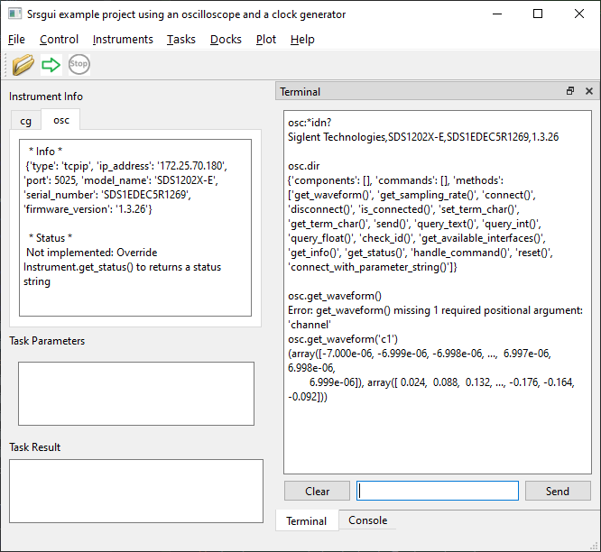

.. _top-of-example-project:

Example project
=================

When you run the ``srsgui`` application, the console window shows
where Python is running from, and where ``srsgui`` is located.
If you go into the directory where ``srsgui`` resides, you can find
the 'examples' directory. When you find a  .taskconfig file in "oscilloscope example"
directory, Open the file from the **File/Open Config** menu of ``srsgui`` application.
If you plan to modify files in the project, you should copy the whole **examples** directory
to a separate location (outside of the virtual environment or Python directory; 
e.g. where you usually keep your documents for programing). 
Then you can open and modify the .taskconfig file in the copied directory
without any worry of corrupting or losing the original files.

As an example project for ``srsgui``, I wanted to use ubiquitous measurement
instruments with remote communication available. I happened to have an
oscilloscope and a function generator (more specifically, a clock generator)
on my desk:

    - Siglent SDS1202XE_ digital oscilloscope (1 GSa/s, 200 MHz bandwidth).
      I bought it because of its affordable price and it works nicely!

    - Stanford Research Systems CG635_, 2 GHz Clock Generator
      (Disclaimer: I work for the company).

I built a project that controls both instruments and
captures output waveform from the clock generator with the oscilloscope,
calculates an FFT, and displays the waveforms in the ``srsgui`` application.

Any oscilloscope and function generator will work for this example.
If you are interested in ``srsgui``, chances are you can find an oscilloscope
and a function generator somewhere in your building.

If you could not, don't worry. Even without an any instruments, we can generate a
simulated waveform to demonstrate the usability of ``srsgui`` as an organizer for
Python scripts and GUI environment for convenient data acquisition and data visualization.

Directory structure
---------------------

Let's look at the directory structure of the project.

.. code-block::

    /Oscilloscope example project directory
        /instruments
            cg635.py
            sds1202.py
        /tasks
            identify.py
            plot_example.py
            ...

        oscilloscope example project.taskconfig

This file structure follows the guideline described in
:ref:`Creating file structure for a project`.
We have two instrument driver scripts for SDS1202XE_ and CG635_
in the subdirectory called **instruments**, five task scripts
in the subdirectory called **tasks**, plus a configuration file
in the project root directory.

Project configuration file
-----------------------------

The structure of a .taskconfig file is simple and
explained in :ref:`Populating the .taskconfig file`

.. code-block::
    :linenos:

    name: Srsgui Example - Oscilloscope and Clock Generator

    inst: cg,  instruments.cg635,   CG635
    inst: osc, instruments.sds1202, SDS1202

    task: *IDN test,                 tasks.idenfify,  Identify
    task: Plot example,              tasks.plot_example, PlotExample
    ...

Instrument drivers
--------------------

CG635
^^^^^

Let's take a look into the `instruments/cg635.py` module. Even though it seems long,
it has only 5 lines of non-comment code. If you have a CG635,
congratulations! You can use the file as is. If you have any function
generator that can change the output frequency, you can use it instead of the CG635
in the example. You change the class name and _IdString to match the instrument name,
along with _term_char. Look up the command to change frequency, referring to the manual.
Save the .py file with a (different) appropriate filename. Change the `inst:` line for `cg`
in the .taskconfig file to match the module path and the class name that you created.

.. code-block::
    :linenos:

    from srsgui import Instrument
    from srsgui.inst import FloatCommand

    class CG635(Instrument):
        _IdString = 'CG635'
        frequency = FloatCommand('FREQ')

Without redefining **available_interfaces** class attribute, you can use serial
communication only. If you want to use GPIB communication, you have to un-comment the
**available_interfaces** in CG635 class.

.. code-block::

    from srsgui import SerialInterface, FindListInput
    from srsinst.sr860 import VisaInterface

    available_interfaces = [
        [   SerialInterface,
            {
                'COM port': FindListInput(),
                'baud rate': 9600
            }
        ],
        [   VisaInterface,
            {
                'resource': FindListInput(),
            }
        ],
    ]

You must install `srsinst.sr860`_ for VisaInterface class, and PyVISA_ and
its backend library, following PyVisa installation instruction.

Once the CG635 (or your function generator) is connected, 
you will see the connection information in the instrument info panel,
and you can use it in the terminal, as shown below.

.. figure:: ./_static/cg-terminal-screen-capture.png
    :align: center
    :figclass: align-center

|

To fix the 'Not implemented' warning,
:meth:`Instrument.get_status() <srsgui.inst.instrument.Instrument.get_status>`
needs to be redefined. 
For example, we can override it as following:

.. code-block::

    def get_status(self):
        return 'Status: OK'

(If you are familiar with status bytes, you can override the `get_status` method
to query the status byte(s) and return the relevant status information as you desire.)

We will use only one command \.frequency, or its raw remote command, 'freq' in this example.
Because 'cg' is the default instrument (the first instrument mentioned in the .taskconfig file),
any raw remote command without the 'cg:' prefix will be sent to it.
Both '\*idn?' and 'cg:\*idn?' will return the same reply.

We use the prefix 'cg:' for raw remote command and the prefix 'cg.' for Python commands.
In the terminal all attributes and methods of CG835 class can be used with prefix 'cg.'.
Because we defined frequency as a FloatCommand, we can also use the 'cg.frequency' property in the
terminal. This means that the following are equivalent:
- `cg:freq 100.0`
- `cg.frequency 100`
  
Furthermore, from a Python script, once `get_instrument('cg')` has been called in a task class,
you can use `cg.frequency = 100` in the Python task code (or `cg.frequency` as the query form).

Actually you can use all the attributes and methods defined in the CG635 class and its super classes.
The `cg.dir()` method (where `dir()` is defined in :class:`Component <srsgui.inst.component.Component>` class)
shows all the available components, commands, and methods available to an instance of the CG635 class. 
This helps us to navigate through resources available with the class.

.. figure:: ./_static/cg-dir-terminal-screen-capture.png
    :align: center
    :figclass: align-center

Cracking open the instrument manual and defining useful methods in an instrument class 
provides ease of instrument control from either the Terminal or from your task code, 
without having to remember the remote command mnemonics themselves. 

SDS1202
^^^^^^^

Even though you may not have an SDS1202 oscilloscope that I happened
to use for this example, I bet you can find an oscilloscope somewhere
in your building. When you get a hold of one, it may have a USB connector only,
like a lot of base model oscilloscopes do.
This means you may have to use USB-TMC interface. 
In order to do that, you need to install PyVISA. 
You need to uncomment the available_interfaces of SDS1202 class, 
modify it to fit the specification of your oscilloscope, along with
changing to the correct `_IdString`. 
Then you have to get waveform download working, which often involves recieving and properly parsing binary data
(binary data is used to minimize the number of characters sent over the remote communication interface,
thereby making data transfers of perhaps very lengthy waveforms relatively fast).
If you are lucky, you can find a working Python snippet from judicious web search.
If not, you have to decipher the programming manual of the oscilloscope. 
It may take time, but it will be very rewarding for your data acquisition
skill-set improvement.

Other than the binary waveform download, 
most other commands for interacting with the oscilloscope 
will be standard ASCII-based text commands.

.. note::
  With default available_interfaces of Instrument class, TcpipInterface should be used with port 5025.

The instrument driver for SDS1202 will work with 4 lines of code, just like the CG635,
before adding the method to download waveforms from the oscilloscope. 
Add attributes and methods incrementally as you need to use more functions of the instrument.

.. code-block::
    :linenos:

    import numpy as np
    from srsgui import Instrument

    class SDS1202(Instrument):
        _IdString = 'SDS1202'

        def get_waveform(self, channel):
            ...

        def get_sampling_rate(self):
            ...

Once the oscilloscope is connected to the application, you can use the terminal to explore the oscilloscope.

|

Because 'osc' is not the default instrument, you have to use the prefix 'osc:' with all the
raw remote commands you send to the instrument. As shown with 'osc.dir', there are many methods
available with 'osc.' Even osc.get_waveform() is available from the terminal. 
When you use a method incorrectly, the terminal kindly tells me that there is a missing argument 
in a function call.
You can see `osc.get_waveform(channel)` returns two numpy arrays.
What if you want to plot the data?
As the methods you implement for interacting with your instruments and data grow in complexity,
you may need to graduate from terminal-based interaction to task-based interaction. Read on.

Tasks
-------

How to run a task
^^^^^^^^^^^^^^^^^^^

Start the ``srsgui`` application. You can see where the .taskconfig file is opened
from the console window (:ref:`here <top-of-initial-screen-capture>`).
If you made a copy of the original example from the ``srsgui``
package directory, open it again from the correct directory.

If there are no error messages in the Console window, connect the function generator
and the oscilloscope from the Instruments menu.

The overall structure of a task is described in :ref:`Writing a task script` section.
There are 5 tasks are included in the example project. They gradually add more features
on the top of the previous tasks. 
They are designed to showcase how to use the Task class.

Select the first task (\*IDN test) from the Tasks menu
and click the green arrow in the tool bar to run the task.

Identify task
--------------

The Identify task shows:

    - How to use module-level logger for Python logging_ in a task
    - How to use instruments defined in the configuration file
    - How to use text output to the console window

It is not much different from the :ref:`bare bone structure <top-of-bare-bone-task>`
shown in the :ref:`Writing a task script` section.

.. literalinclude:: ../srsgui/examples/oscilloscope example/tasks/identify.py
    :language: Python
    :linenos:

Using **self.logger** sends the logging output to the console window, the master logging file in
`~/task-results directory/mainlog-xx.txt.x`, and to the task result data file located in
`~/task-results/project-name-in-config-file/RNxxx` directory.

With :meth:`get_instrument <srsgui.task.task.Task.get_instrument>` you can get the instrument
defined in the configuration file in a task. **Do not disconnect the instrument in the task!**
Instrument Connectivity is managed at the ``srsgui`` application level.

This task highlights how remote command set and query transactions are simplified by defining 
an attribute using :mod:`srsgui.inst.commands` module, 
which is utilized in the CG635 class definition via the following line:  

``frequency = FloatCommand('FREQ')``

This simple line makes it possible to set and query the `cg.frequency` 
without having to directly manipulate command or response strings. 

PlotExample task
-----------------

The PlotExample task requires no instrument connections, and shows:

    - How to define :attr:`input_parameters <srsgui.task.task.Task.input_parameters>`
      for interactive user input from the application input panel
    - How to use matplotlib figures for plotting data
    - How to send text output to the result window using
      :meth:`display_result() <srsgui.task.task.Task.display_result>`
    - How to stop the task by checking
      :meth:`is_running() <srsgui.task.task.Task.is_running>`.

.. literalinclude:: ../srsgui/examples/oscilloscope example/tasks/plot_example.py
    :language: Python
    :linenos:

Using matplotlib_ with ``srsgui`` is straightforward if you are already familiar with its usage.
(Refer to matplotlib_ documentation).

The important differences when using matplotlib in ``srsgui`` are:
    - You have to get the figure using get_figure(), rather than creating one on your own.
    - Plots are created during `setup()`, because it is a slow process. During `test()`,
      you simply update data using `set_data()` or similar methods for data update.
    - You must use `request_figure_update()` to redraw the plot, after `set_data()`.
      The event loop handler in the main application will update the plot at its earliest
      convenience.

.. figure:: ./_static/second-task-screen-capture.png
    :align: center
    :figclass: align-center

|

ScopeCapture task
------------------

The ScopeCapture task uses the oscilloscope only. It gets the requested number of captures from user input,
then repeats oscilloscope waveform capture and updates the waveform plot. 
It stops once the desired number of captures have been obtained, or when the Stop button is pressed.
Waveforms are captured with 700000 points about every 0.2 seconds over TCP/IP communication.

.. literalinclude:: ../srsgui/examples/oscilloscope example/tasks/scope_capture.py
    :language: Python
    :linenos:

.. _top-of-captured-fft:

CapturedFFT task
-----------------

The CaptureFFT task is the climax of the examples series (:ref:`screenshot <top-of-screen-capture-1>`).
It uses `input_parameters` to change output frequency of the clock generator interactively,
captures waveforms from the oscilloscope, calculates an FFT of the waveforms with numpy,
and generates plots using 2 matplotlib figures.

By adding the names of figures that you want to use in additional_figure_names,
``srsgui`` provides more figures to the task before it starts.

.. literalinclude:: ../srsgui/examples/oscilloscope example/tasks/captured_fft.py
    :language: Python
    :linenos:

SimulatedFFT task
------------------

The SimulatedFFT task shows how to subclass an existing task class for reuse.
The method get_waveform() in the CaptureFFT example is reimplemented to generate
simulated waveform that runs without any real oscilloscope.

Note that the square wave edge calculation is crude, causing modulation in pulse width
and side bands in the FFT spectrum if the set frequency is not commensurate with
the sampling rate. To generate a clean square wave, the rising and falling edges should
have at least two points to represent exact phase. Direct transition from low to high
without any intermediate points suffers from subtle modulation in time domain,
which manifests as side bands in FFT. This is a common problem in digital signal
processing. It is not a problem in the real world, because the signal is analog,
and the sampling rate is limited by the bandwidth of the signal.

.. literalinclude:: ../srsgui/examples/oscilloscope example/tasks/simulated_fft.py
    :language: Python
    :linenos:

.. _PyVisa: https://pyvisa.readthedocs.io/en/latest/
.. _srsinst.sr860: https://pypi.org/project/srsinst.sr860/
.. _VXI11: https://www.lxistandard.org/About/VXI-11-and-LXI.aspx
.. _GPIB: https://en.wikipedia.org/wiki/IEEE-488
.. _USB-TMC: https://www.testandmeasurementtips.com/remote-communication-with-usbtmc-faq/
.. _SDS1202XE: https://siglentna.com/product/sds1202x-e/
.. _SRS: https://thinksrs.com/
.. _CG635: https://thinksrs.com/products/cg635.html
.. _logging: https://docs.python.org/3/howto/logging.html
.. _matplotlib: https://matplotlib.org/stable/index.html