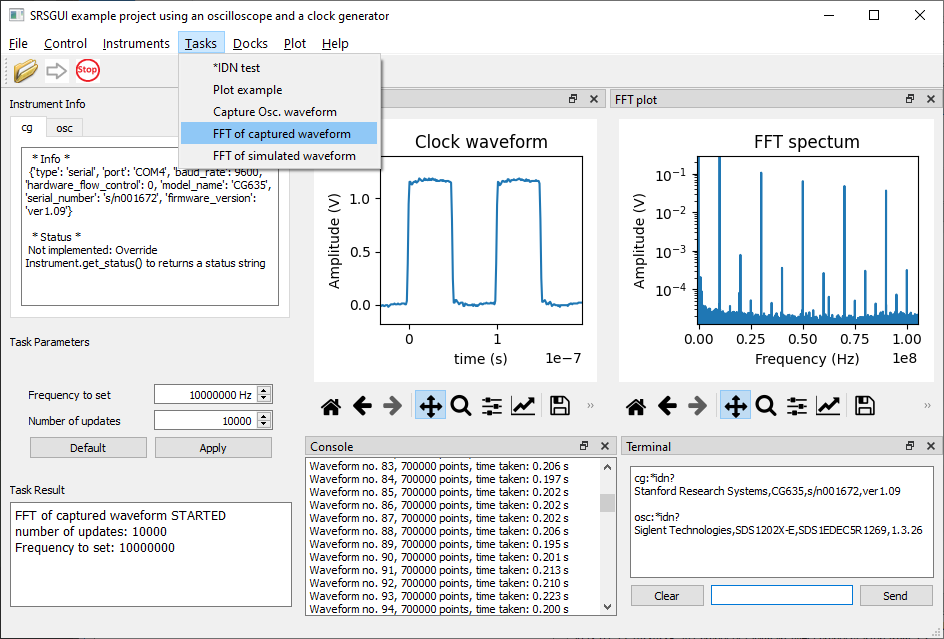

.. srsgui documentation master file, created by
   sphinx-quickstart on Wed Dec  7 16:34:11 2022.
   You can adapt this file completely to your liking, but it should at least
   contain the root `toctree` directive.

``srsgui`` : Organize your instrument-controlling Python scripts as a GUI application
=======================================================================================

``Srsgui`` is a simple framework:

   - To define instrument classes for instruments that use remote communication,
     based on :class:`Instrument<srsgui.inst.instrument.Instrument>`
     class and the communication
     :class:`Interface<srsgui.inst.communications.interface.Interface>` class.

   - To write Python scripts (tasks) that run in GUI environment with simple APIs
     provided in :class:`Task<srsgui.task.task.Task>` class.

   - To organize instrument classes and task scripts presented in a GUI application
     using a configuration (.taskconfig) file for a project

``Srsgui`` provides the following I/O functionality to a task:

   - Python logging output to a console window and a log file
   - `print` function redirected to the console window
   - text streaming to multiple selectable windows
   - terminal from which you can control and query interactively all the instrument defined in the configuration file
   - real-time updating, non-blocking, multiple matplotlib figures_ that can include multiple axes_
   - interactively changeable  input parameters fed into a running task
   - Qt's dockable windows makes layout flexible(
     :ref:`before <top-of-initial-screen-capture>` and
     :ref:`after <top-of-screen-capture-1>`)
   - dedicated output data file generated for each run of a task

Here is a screen shot of ``srsgui`` running with the :ref:`example project <top-of-example-project>`
included in the ``srsgui`` package.

.. _top-of-screen-capture-1:

From the :ref:`Example project <top-of-example-project>` directory, you can see how many lines of code
you need write to get ``srsgui`` working for control and data acquisition
from a couple of arbitrary instruments and data visualization for a small task.

   - 5 lines of code for CG635 to control its
     output frequency (if not count comment lines);
   - 40 lines to capture waveforms from an oscilloscope (it has a method
     to download a waveform from the oscilloscope);
   - 100 lines in the fourth example to check if set frequency
     changed from the input panel, set a new frequency if changed,
     capture a new waveform of 700000 points, calculate FFT of the waveform
     and plot them every 0.2 second;
   - 8 line in the configuration file to put all together.

If you want to implement a well-defined single operation, it will be as simple as this.
Well, it is mostly thanks to conciseness of Python code and its rich libraries, though.

When you implement many tasks handling multiple operations along with larger sets of
remote commands for multiple instruments, ``srsgui`` also provides more ways to
organize your code.

Here are more information on how to use ``srsgui``.

.. toctree::
   :maxdepth: 2

   installation.rst
   create-project.rst
   define-instrument.rst
   create-task.rst
   example.rst
   srsgui.rst
   troubleshooting.rst
   changelog.rst

Indices and tables
==================

* :ref:`genindex`
* :ref:`modindex`
* :ref:`search`

.. _figures: https://matplotlib.org/stable/tutorials/introductory/quick_start.html#figure
.. _axes: https://matplotlib.org/stable/tutorials/introductory/quick_start.html#axes