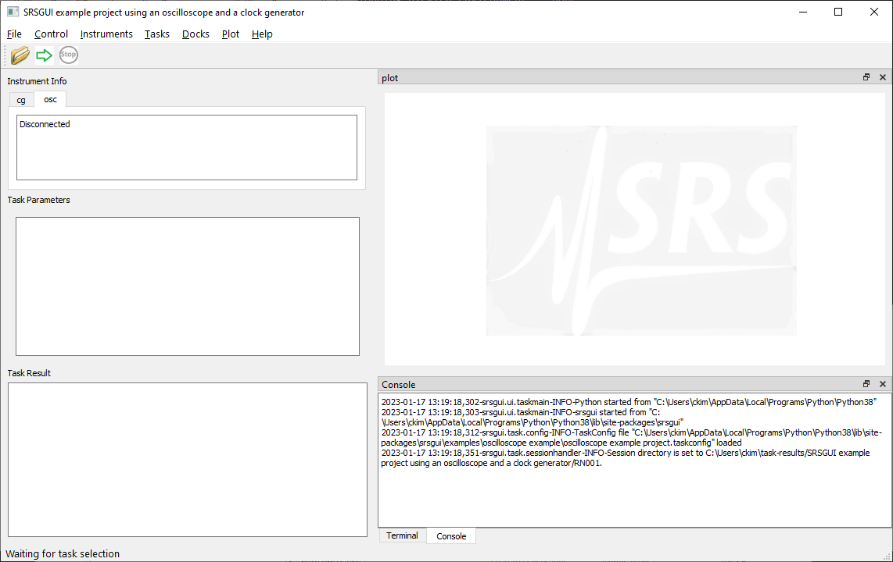

Installation
==============

Preparation
------------

To install ``srsgui``,  make sure you have Python version 3.7 or later.
you can check your Python version by running from the command prompt:

.. code-block::

    python --version

.. note::

    Commands running from the command prompt shown here are assumed using
    a Windows computer system. If you use other systems, commands may be
    different. Refer to `this page. <install-packages_>`_

If your version of Python is older than the required version,
`install a newer version of Python. <install-python_>`_

Using a `virtual environment <virtual-environment_>`_ helps to avoid possible dependency
conflicts among Python packages. If you want to use a virtual environment, create one with
your favorite virtual environment package. If you do not have a preference,
use Python default ``venv``.

.. code-block::

    python -m venv env
    .\venv\Scripts\activate

.. note::
    Commands to use ``venv`` are different among computer systems. 
    For operating systems other than Windows, refer to `this page <venv_>`_.

Srsgui installation
--------------------

To run ``srsgui`` as a GUI application, install it with [full] option using pip_:

.. code-block::

    python -m pip install srsgui[full]

This will install the ``srsgui`` package along with
the 3 main packages (pyserial_, matplotlib_ and pyside6_) and their dependencies.

If

    - you plan to use the instrument driver part of ``srsgui`` only, without GUI support,
    - your system requires installation of matplotlib_ or pyside6_ from sources other than pip
      (Some Linux systems do so),
    - you want to use pyqt5_ or pyside2_ instead of pyside6_ as GUI backend, or
    - you have trouble with the full installation and you want to install the dependencies manually,

you can install without the extra [full] option:

.. code-block::

    python -m pip install srsgui

This will install ``srsgui`` with pyserial_ only.

.. note::
    ``srsgui`` runs with either pyside6_, pyside2_, or pyqt5_ installed as the GUI backend.
    If your system already has pyside2_ or pyqt5_ installed, you do not have to install pyside6_.
    To determine if these are installed, you can check the following from a terminal:

        python -m pip show pyside2

        python -m pip show pyqt5

    

.. note::
    In order to maintain the MIT_ license for your projects or modified ``srsgui``, you have to use
    pyside6_ or pyside2_. pyqt5_ imposes the GPLv3_ license to any packages using pyqt5_.

Starting srsgui application
----------------------------

After ``srsgui`` is installed, you can start ``srsgui`` application from the command prompt.

.. code-block::

    srsgui

    or

    python -m srsgui

``srsgui`` installs an executable script named "srsgui" in the Python/Scripts directory.
If the directory is included in PATH environment variable, **srsgui** command will work.
Otherwise, **python -m srsgui** will work regardless of PATH setting.

.. _top-of-initial-screen-capture:

If you see the application is open and running, the installation was successful!

.. note::
    Instead of seeing the application running, you may get errors (most likely, an `ImportError`).
    Carefully look through the exception traceback to find out which package caused the error.
    When the latest version of python is installed, some packages may not be installed properly. 
    If the problem is not from ``srsgui`` directly, a web search of the problem usually leads to a fix.

.. _install-packages: https://packaging.python.org/en/latest/tutorials/installing-packages/
.. _install-python: https://www.python.org/
.. _virtual-environment: https://realpython.com/python-virtual-environments-a-primer/
.. _venv: https://packaging.python.org/en/latest/guides/installing-using-pip-and-virtual-environments/
.. _pip: https://realpython.com/what-is-pip/
.. _pyserial: https://pyserial.readthedocs.io/en/latest/pyserial.html
.. _matplotlib: https://matplotlib.org/stable/tutorials/introductory/quick_start.html
.. _pyside6: https://wiki.qt.io/Qt_for_Python
.. _pyside2: https://pypi.org/project/PySide2/
.. _pyqt5: https://pypi.org/project/PyQt5/
.. _numpy: https://numpy.org/install/
.. _Mit: https://choosealicense.com/licenses/mit/
.. _GPLv3: https://choosealicense.com/licenses/gpl-3.0/
